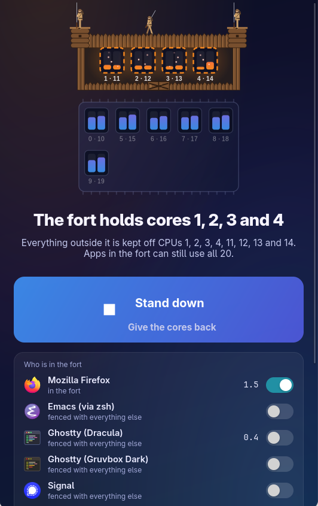

# Fort Galgs

Reserve a few of a Linux machine's fastest CPU cores for the apps you care
about — a game, a video call — and fence everything else off them, so a CI
run in a VM, a container build, or a test sweep in tmux cannot starve them.

One window: a live map of the chip, with the reserved cores inside a log
stockade while the fort is up and a grove of trees where it stood while it is
down; beside each running app, a switch to move it into or out of the fort
now and a pin to keep it there; and one button to raise the fort or stand
down. Mountain men stand watch on the walls while it is up.

<p align="center">
  
</p>

Requires systemd with cgroup v2. Arch Linux is the packaged target.

| File | Installed to | Does |
|------|--------------|------|
| `fort-galgs` | `/usr/bin` | GTK front end |
| `fortctl` | `/usr/bin` | Backend: `status [--json]`, `on`, `off`, `protect`/`unprotect <app>...`, `pin`/`unpin <app>...`, `adopt <pid>`, `watch`; root half via `--system on\|off` |
| `fort-galgs.toml` | `/etc` | How many cores to reserve |
| `sudoers.in` | `/etc/sudoers.d/fort-galgs` | Lets the `fort-galgs` group run exactly `fortctl --system on` and `… off` |
| `sysusers.conf` | `/usr/lib/sysusers.d/fort-galgs.conf` | Creates that group |
| `systemd/fort-galgs-cpuset.conf` | `/usr/lib/systemd/system/user@.service.d/` | Delegates the cpuset controller to user sessions |
| `systemd/fort-galgs-watch.service` | `/usr/lib/systemd/user/` | Pulls pinned apps in as they start, while the fort is up |

## Configuring

`/etc/fort-galgs.toml` sets how many cores the fort holds:

```toml
reserve_cores = 4      # physical cores; each brings its SMT sibling
```

Which apps always live in the fort is each user's choice. Pin one with the
pin beside it in the window, or `fortctl pin steam` (`fortctl unpin steam`).
Pins go in `~/.config/fort-galgs.toml`:

```toml
apps = ["steam"]       # by .desktop id; the window writes these
protect = []           # by process name (/proc/<pid>/comm), for apps
                       # without a .desktop entry; edit by hand
```

Pinned apps are pulled into the fort whenever it is up, including ones that
start later; the watcher rereads the file every few seconds. A pinned app
cannot be switched out of the fort while it stays pinned.

## What "on" does

The reserved CPUs are the `reserve_cores` cores with the highest
`cpuinfo_max_freq`, plus their SMT siblings. Those are the cores the
scheduler prefers (Turbo Boost Max, preferred cores, P-cores on hybrid
parts), so without a fence background work lands on them first. Ties go by
core id, with CPU 0's core last, since it takes the most interrupts.

1. Every pinned app's scope moves into `fort.slice`
   in the user's systemd manager, which gets `CPUWeight=1000`. `fort.slice` is
   never fenced: apps inside keep every CPU and have the reserved ones to
   themselves. `fort-galgs-watch.service` starts and keeps pulling such apps
   in as they launch.
2. `app.slice` and `background.slice` (terminals, tmux, tests, sandboxes) get
   `AllowedCPUs=` the other CPUs.
3. As root: `machine.slice` (VMs) and `system.slice` (docker, services) get
   the same.

Every change is `--runtime`, so a reboot takes the fort down. `off` reverses
steps 2 and 3, resets the weight and stops the watcher. Apps stay in
`fort.slice`, where they do no harm.

Only scopes move, never services: pulling a service's processes out from
under it would break the service.

**Step 2 needs cpuset delegated** to `user@.service`, which systemd does not
do by default. The package's drop-in does it, but a running user manager only
sees it after `systemctl --user daemon-reexec` (a logout does not restart the
manager of a user who lingers). Until then step 2 is skipped, and the window
and `status` say so.

## Protecting an app by hand

In the window, flip the switch beside it. From a shell:

```bash
fortctl protect firefox     # every scope holding a process named firefox
fortctl unprotect firefox
fortctl protect app-gnome-firefox-2435960.scope   # one scope, exactly
```

It helps only while the fort is up, and lasts until the app quits or the
machine reboots. To keep an app in the fort for good, pin it instead (see
Configuring). Pinned apps cannot be moved out: the watcher would only pull
them back.

## Installing

Fort Galgs is not on the AUR; build the package from this repo:

```bash
git clone https://github.com/mgalgs/fort-galgs
cd fort-galgs/packaging/arch
makepkg -si
# that builds what is on GitHub; to build your local checkout instead:
FORT_GALGS_GIT=git+file://$PWD/../.. makepkg -si
```

Then, once per desktop user:

```bash
sudo gpasswd -a "$USER" fort-galgs
systemctl --user daemon-reexec
```

Without a package, `sudo make install` installs the same files under `/usr`.

## Hacking on it

`make dev-launcher` points the desktop launcher at this checkout, so the
next launch runs your working tree. No build and no sudo are needed;
`make undev-launcher` points it back. The root half (`fortctl --system`, the
sudoers rule and the systemd units) is still the installed package. To change
that, `make pkg` builds the package from your local commits and prints the
`sudo pacman -U` that installs it.

## Checking it after a change

```bash
make check
./fort-galgs --self-test              # builds every page, draws every state
./fort-galgs --snapshot /tmp/fort.png  # the fort, down and up, from live load
./fortctl status
```
